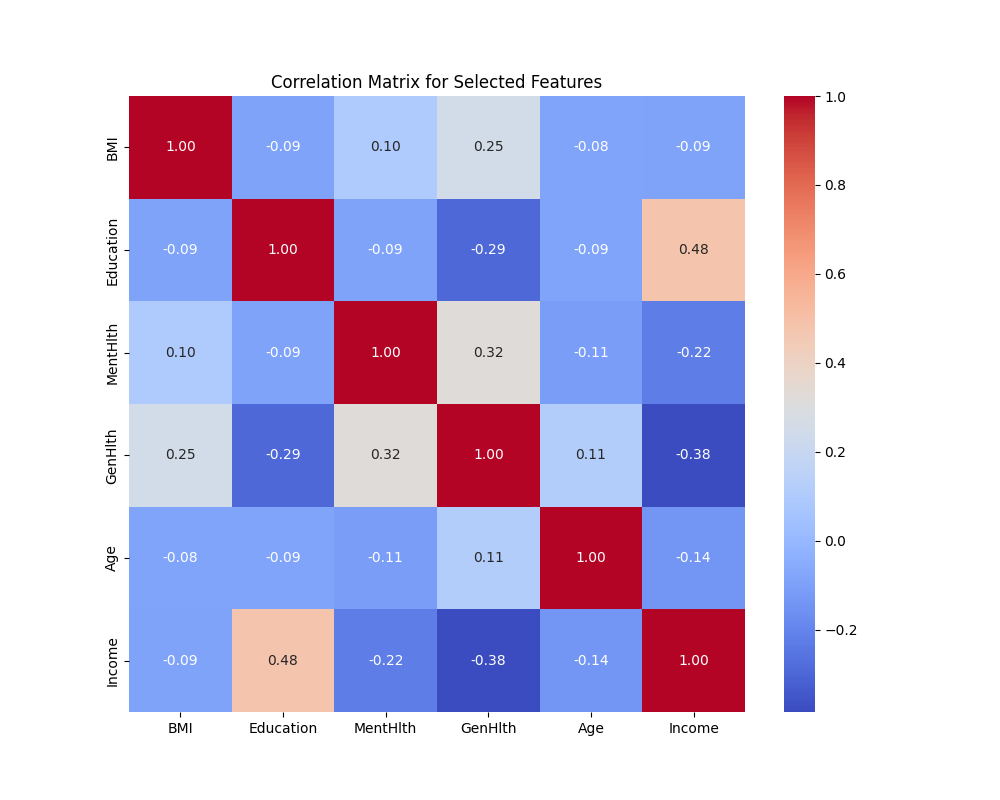
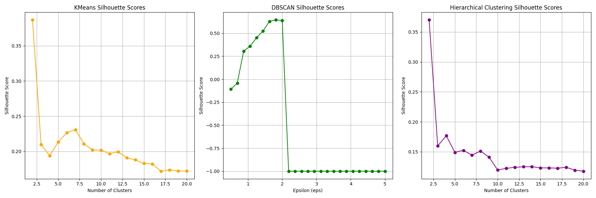
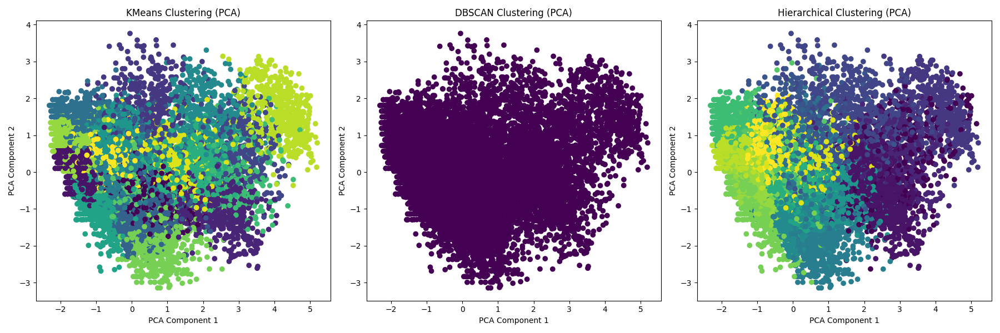
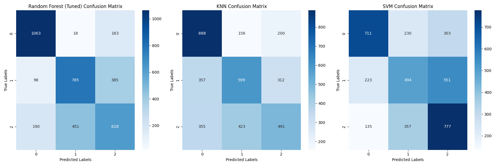
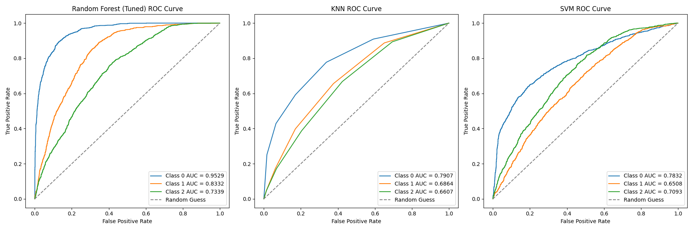

# Understanding What Factors Lead To Diabetes Using Machine Learning

## Tanjodh Hayer (301432974), Mohammad Haris Ahmad (301427462), Inderpreet Rangi (301433641)
## Simon Fraser University, CMPT 459 - Fall 2024

### Problem Statement
Diabetes is a common health issue that many people face. We wanted to figure out what were some of the leading factors that cause it such that at-risk individuals can be identified early, potentially reducing the prevalence or severity of diabetes. 

### Selected Dataset: 
Diabetes Health Indicators Dataset: [https://www.kaggle.com/datasets/alexteboul/diabetes-health-indicators-dataset]
This dataset came from Kaggle and it represents the connections between the human lifestyle and diabetes within the United States of America. Each row within this dataset is a US citizen who had participated in this survey conducted by the CDC. This dataset has 253681 entries and consist of the following features
Numerical:
- BMI (Body Mass Index)
- GenHlth (General health status, rated on a scale)
- MentHlth (Mental health status, rated on a scale)
- PhysHlth (Physical health status, rated on a scale)
- Age (Age category)
- Education (Education level)
- Income (Income level)
Categorical:
- Diabetes_012 (Diabetes classification: No diabetes,Prediabetes, Diabetes)
- HighBP (High blood pressure status: Yes or No)
- HighChol (High cholesterol status: Yes or No)
- CholCheck (Cholesterol check status: Yes or No)
- Smoker (Smoking status: Yes or No) 
- Stroke (Stroke status: Yes or No)
- HeartDiseaseorAttack (Heart disease or attack status: Yes or No)
- PhysActivity (Physical activity status: Yes or No)
- Fruits (Fruit consumption: Yes or No)
- Veggies (Vegetable consumption: Yes or No)
- HvyAlcoholConsump (Heavy alcohol consumption status: Yes or No)
- AnyHealthcare (Access to healthcare: Yes or No)
- NoDocbcCost (Cost barriers to healthcare: Yes or No)
- DiffWalk (Difficulty walking status: Yes or No)
- Sex (Gender: Female or Male)

 
To run this program enter the following command: 
python main.py --data "dataset.csv"

### Data Table (5 Rows)

| Diabetes_012 | HighBP | HighChol | CholCheck | BMI | Smoker | Stroke | HeartDiseaseorAttack | PhysActivity | Fruits | Veggies | HvyAlcoholConsump | AnyHealthcare | NoDocbcCost | GenHlth | PhysHlth | DiffWalk | Sex | Age | Education | Income |
|--------------|--------|----------|-----------|-----|--------|--------|----------------------|--------------|--------|---------|-------------------|---------------|-------------|---------|----------|----------|-----|-----|-----------|--------|
| 0            | 1      | 1        | 1         | 40  | 1      | 0      | 0                    | 0            | 0      | 1       | 0                 | 1             | 0           | 5       | 18       | 1       | 1   | 7   | 6         | 4      |
| 0            | 0      | 0        | 0         | 25  | 1      | 0      | 0                    | 0            | 1      | 0       | 0                 | 0             | 1           | 0       | 0        | 0        | 0   | 4   | 5         | 6      |
| 2            | 1      | 1        | 1         | 30  | 1      | 0      | 1                    | 1            | 0      | 0       | 1                 | 1            | 1           | 0       | 0        | 1        | 0   | 6   | 6         | 5      |
| 1            | 1      | 1        | 1         | 32  | 1      | 1      | 0                    | 1            | 0      | 0       | 1                 | 0             | 1           | 0       | 30       | 1        | 0   | 12   | 4         | 5      |
| 0            | 1      | 0        | 1         | 30  | 0      | 0      | 0                    | 1            | 1      | 1       | 0                 | 1             | 0           | 0       | 0        | 1        | 0   | 9   | 3         | 4      |


## Methodology
### Data Preprocessing
Data preprocessing is a crucial step in preparing raw data for the machine learning tasks that follow. Here's a detailed overview of the steps we implemented:

We began by converting all categorical columns into numeric values using label encoding. This transformation ensures compatibility with machine learning models, which generally require numerical inputs. Encoding these features enabled their effective use during the training of the three chosen models.

The target variable, Diabetes_012, was rounded and converted to an integer type, with the classes represented as follows:

    0: No Diabetes
    1: Diagnosed Diabetes
    2: Prediabetic.

This conversion was performed to maintain consistency and prevent errors during model training and classification.

To handle missing data, we imputed missing values in the features using the mean of each column. This approach preserves dataset completeness while providing reasonable estimates for missing entries.

Feature standardization was also applied, ensuring all features had a mean of 0 and a standard deviation of 1. This step is pretty important for algorithms like K-Means and Support Vector Machines (SVM), which are sensitive to feature scaling. 

Our initial dataset contained over 200,000 samples, but there was a significant imbalance for the classes. To address this, we applied SMOTE (Synthetic Minority Oversampling Technique) to balance the class distribution by generating synthetic samples for the minority classes. This allowed the models to become biased towards the majority class. However, applying SMOTE increased the dataset size to over 600,000 samples, which is quite big and slowed down a lot of our processes. To solve this, we reduced the dataset to 20,000 samples by just subsampling the original. This method preserved the class proportions, ensuring an equal class distribution while making the dataset manageable for machine learning tasks (especially for us). 

To verify the effectiveness of our preprocessing, we visualized the class distributions before and after SMOTE and subsampling. These plots provide clear evidence of the process and outcomes.

Finally, to save time during subsequent runs, the processed dataset was saved as dataset_processed.csv. A utility function checks for the existence of this file:

    If the file exists, the code skips preprocessing and directly loads the cleaned, balanced, and scaled dataset.
    If the file does not exist, the preprocessing pipeline runs on the original dataset to regenerate and save the processed version.

 Note: we do have some warnings that come up during the running process that can be ignored as it does not impact or hinder the work being done. 

### Class Distribution Before SMOTE


### Class Distribution After SMOTE and Stratified Sampling


### Exploratory Data Analysis (EDA)

Exploratory Data Analysis (EDA) is an essential step in understanding the underlying patterns and relationships within a dataset. It helps to detect anomalies, check any assumptions, and give us details in a structure of within the data. In this analysis, we performed EDA by calculating summary statistics, visualizing key features, and analyzing the correlations between them.

Summary Statistics: We began by generating a summary of the dataset using the describe() function.
```python
summary_stats = data.describe().transpose()
```
This provides basic statistical metrics, such as the mean, standard deviation, minimum, maximum, and percentiles for all numerical features, helping to understand the distribution and range of values in the dataset.


Visualizing Distributions: Histograms were used to visualize the distributions of key features. This step helps identify the shape of the distributions (e.g., normal, skewed) and potential transformations needed to improve model performance or meet statistical assumptions.


Correlation Analysis: We calculated the correlation matrix to examine relationships between numerical features. A heatmap was created to visualize these correlations, enabling us to understand how features are related and identify any potential multicollinearity or redundant features.


### Outlier Detection
Outlier detection is being done using three algorithms to identify exreme or anomalous values that could effect the results of the classification and modeling. Outliers can make our results not be accurate and affect model performance as well as clustering results since clustering is sensitive to extreme values. We did outlier detection using three algrothims: Local Outlier Factor (LOF), Isolation Forest (IF) and Elliptic Envelope (EE). The visualizations of these outliers are in red and inliers are in blue. Two parameters we used for these methods were contamination and random_state. Random_state was set to 42 for reproducibility while contatmination was set to 0.02 ie. 2% after trying various rates because there is a decent amount of skewness after using SMOTE and the irregularness of data for medical features as its varies greatly depending on people. However, the reason ccontatmination is not set higher is because normal data would end up being flagged as outliers.

- LOF: Detects the local density of data points and identifies points that are significantly lower compared to its neighbours where in it flags those outliers.
```python
lof = LocalOutlierFactor(n_neighbors=n_neighbors, contamination=contamination)
```
_Plot.png)
- IF: the dataset is randomly portioned thereby isolating points, the more isolated a point is the more likely its an outlier this method is also useful for high dimensional data.
```python
iso_forest = IsolationForest(contamination=contamination, random_state=random_state)
```
_Plot.png)
- EE: identifies points that lie outside the expected distribution as outliers. It works well when the data follows a normal distribution and detects outliers based on their deviation from the fitted "ellipse."
```python
elliptic = EllipticEnvelope(contamination=contamination, random_state=random_state)
```
_Plot.png)

All three of these methods provide somewhat similar results which showed the outliers, after visualling all of the outliers we decided whether to remove them or not by running the program and checking if the classification accuracy increases or not as well as how the clustering does. After comparing results we noticed that removing the outliers helped train our model with higher accuracy.

Number of rows before cleaning: 20000
Number of rows after cleaning: 18904

Performing 5-fold cross-validation for Default Random Forest with outliers removed
Mean F1-score from 5-fold CV: 0.6757
Accuracy: 0.6793
Precision: 0.6728
Recall: 0.6792
F1-score: 0.6751
AUC-ROC: 0.8468

Performing 5-fold cross-validation for Default Random Forest with outliers kept
Mean F1-score from 5-fold CV: 0.6642
Accuracy: 0.6673
Precision: 0.6615
Recall: 0.6685
F1-score: 0.6642
AUC-ROC: 0.8420

### Feature Selection
In feature selection we identify the most important features to be used for predicting the target variable which is Diabetes_012 using Mututal information and Random Forest feature importance; we were also using Recursive Feature Elimination however as a lower score was better, it was difficult incorporting it with the other two methods which had a higher score because it would not give the best and most important features that should be used in relation to the target variable.

A parameter called final_features_count was added to limit the number of top features to have selected at the end after extensive testing with various number of features. The right amount of features was 6 that were selected at the end for the most optimal training.

Mutual information measures the dependancy between each feature and the target variable and ranks the features by importance, most important has a higher score while least important feature to the target variable has a lower score. We then print the scores of each feature after the features are ranked by their mutual information scores. By peforming Mutual Information with the code below:

```python
    # Performing Mutual Information
    mi = mutual_info_classif(X, y, random_state=42)
    mi_scores = pd.Series(mi, index=X.columns).sort_values(ascending=False)
    print(f"Top features by Mutual Information:")
```
We got back:

Top features by Mutual Information:
BMI:                     0.400397
Age:                     0.320712
Income:                  0.243371
GenHlth:                 0.209824
PhysHlth:                0.185973
MentHlth:                0.145108
Education:               0.123041
HighBP:                  0.076119
HighChol:                0.055660
DiffWalk:                0.036203

Random Forest feature importance is used to assess the importance of features by checking how useful it is in predicting the target variable, rf classifer is fit on the dataset and feature importance are retreived and printed. By performing Random Forest feature important with the code below:

```python
    # Perofmring Feature Importance from Random Forest
    rf = RandomForestClassifier(random_state=42)
    rf.fit(X, y)
    rf_scores = pd.Series(rf.feature_importances_, index=X.columns).sort_values(ascending=False)
    print(f"Feature Importances by Random Forest:")
```

We got back:

Feature Importances by Random Forest:
BMI:                     0.143378
Age:                     0.142385
GenHlth:                 0.130126
Income:                  0.111363
Education:               0.075226
PhysHlth:                0.071757
MentHlth:                0.054882
HighBP:                  0.041824
HighChol:                0.032749
Smoker:                  0.029628

Combining these two methods as such:
```python
    # Combine results by selecting top features from both methods
    # For simplicity, take top features from both methods and ensure we have the desired number of final features.
    mi_top_features = mi_scores.head(final_features_count).index.tolist()
    rf_top_features = rf_scores.head(final_features_count).index.tolist()
```

Ensured that we capture both non-linear(mutual info) and linear (rf) relationships, resulting in a more comprehensive selection of features that are most relevant to the task at hand.

Final Selected Features:
Age
PhysHlth
Education
GenHlth
MentHlth
BMI


The top features selected by both methods are combined and we select the best 6 features, after merging the lists given by both methods. However, we also make sure to do a correlation analysis of these top features selected for better clarity in our selection to make sure they aren't strongly correlated with one another using a heatmap. 



Now considering the evaluation of the models without feature selection, we got back:

Best Silhouette Score for KMeans: 0.1868
Best Silhouette Score for DBSCAN: 0.3448
Best Silhouette Score for Hierarchical Clustering: 0.1624

Random Forest (Tuned) Cross-Validation F1 Score (5-fold): Mean = 0.7256, Std = 0.0076
Random Forest (Tuned) Accuracy: 0.7358
Random Forest (Tuned) Precision: 0.7370
Random Forest (Tuned) Recall: 0.7363
Random Forest (Tuned) F1-score: 0.7366
Random Forest (Tuned) AUC-ROC: 0.8904

KNN Cross-Validation F1 Score (5-fold): Mean = 0.5591, Std = 0.0059
KNN Accuracy: 0.5803
KNN Precision: 0.5889
KNN Recall: 0.5801
KNN F1-score: 0.5770
KNN AUC-ROC: 0.7638

SVM Cross-Validation F1 Score (5-fold): Mean = 0.5721, Std = 0.0096
SVM Accuracy: 0.5893
SVM Precision: 0.5935
SVM Recall: 0.5895
SVM F1-score: 0.5905
SVM AUC-ROC: 0.7741

Training and Evaluating Random Forest (Default)...
Mean F1-score from 5-fold CV: 0.7197
Accuracy: 0.7374
Precision: 0.7384
Recall: 0.7378
F1-score: 0.7381
AUC-ROC: 0.8886

These results are further discussed down below within the Hyperparameter Tuning section with the feature selection results. 
### Clustering

KMeans Clustering: KMeans is a centroid-based algorithm that aims to partition the data into k clusters, minimizing the variance within each cluster. We test different values of k (from 2 to 20) (21 non inclusive):
```python
RANGE = range(2, 21)
```
and calculate the silhouette score for each. The silhouette score ranges from -1 to 1, with a higher score indicating better-defined clusters. 

After looping through the range of k values, we print the best silhouette score achieved by KMeans.
```python
    for k in RANGE:
        kmeans = KMeans(n_clusters=k, random_state=42)
        kmeans_labels = kmeans.fit_predict(X)
        score = silhouette_score(X, kmeans_labels)
        kmeans_scores.append(score)
```

DBSCAN Clustering: DBSCAN (Density-Based Spatial Clustering of Applications with Noise) groups points that are closely packed together while marking points in low-density regions as outliers. The eps parameter defines the maximum distance between two points for them to be considered neighbors, and min_samples specifies the minimum number of points required to form a dense region (cluster).

We evaluate DBSCAN by testing different values of eps (from 0.5 to 5) and calculate the silhouette score. If DBSCAN produces only one cluster (e.g., when all points are considered noise), we assign a silhouette score of -1 (indicating poor clustering). 
```python
        if len(set(dbscan_labels)) > 1:
            score = silhouette_score(X, dbscan_labels)
            dbscan_scores.append(score)
        else:
            dbscan_scores.append(-1)
```
The best DBSCAN silhouette score is then printed.

Hierarchical Clustering: Hierarchical clustering builds a tree-like structure called a dendrogram, which allows us to visualize the hierarchical relationship between data points. We apply the ward method with Euclidean distance, and for each number of clusters (from 2 to 20), we calculate the silhouette score. 
```python
    for i in RANGE:
        hierarchical_labels = fcluster(linkage_with_euclidean, i, criterion='maxclust')
        score = silhouette_score(X, hierarchical_labels)
        hierarchical_scores.append(score)
```
The best silhouette score for hierarchical clustering is also printed.

Evaluation Using Silhouette Scores: The silhouette score is a crucial metric for evaluating the quality of clustering. It measures how similar each point is to its own cluster compared to other clusters. We compare the silhouette scores for KMeans, DBSCAN, and Hierarchical Clustering to determine which method performs best on the dataset.

To better understand how each clustering method performs, we visualize the silhouette scores using line plots. Three subplots are generated:

The first plot shows the silhouette scores for KMeans as a function of the number of clusters (k).
The second plot shows the silhouette scores for DBSCAN as a function of the eps value.
The third plot shows the silhouette scores for Hierarchical Clustering as a function of the number of clusters.



After clustering, we visualize the results in a two-dimensional space using Principal Component Analysis (PCA), a technique for dimensionality reduction. PCA reduces the dimensionality of the data while preserving the variance, allowing us to project high-dimensional data onto a 2D plane for visualization.

We plot the clustering results for each algorithm (KMeans, DBSCAN, and Hierarchical) on the same 2D plane:

Each data point is colored based on the cluster label assigned by the corresponding algorithm.
This visualization helps us understand the spatial distribution of the clusters and assess how well the clustering algorithm has grouped the data points.



Best Silhouette Score for KMeans: 0.3867
Best Silhouette Score for DBSCAN: 0.6453
Best Silhouette Score for Hierarchical Clustering: 0.3701

### Classification
1. Data Splitting

The dataset was split into features (X) and target (y) based on the specified target column. The data was then divided into training and test sets using the train_test_split function, with 20% of the data allocated to the test set. Stratified sampling was applied to ensure that the class distribution remained consistent between the training and testing sets.
```python
    X = data.drop(columns=[target_column])
    y = data[target_column]
    X_train, X_test, y_train, y_test = train_test_split(X, y, test_size=0.2, stratify=y, random_state=42)
```

2. Model Training and Hyperparameter Tuning (Random Forest)

Hyperparameter tuning was performed on the Random Forest model using RandomizedSearchCV. This approach allowed for random sampling of key hyperparameters such as the number of estimators, maximum depth, minimum samples required for splitting, and other important factors. The scoring metric used for tuning was the F1 score (macro), optimizing for balanced performance across all classes. After identifying the best set of parameters, the tuned Random Forest model was trained and evaluated on the test set.
```python
    randomized_search = RandomizedSearchCV(...)
    randomized_search.fit(X_train, y_train)
    
    # Get the best Random Forest model
    best_rf = randomized_search.best_estimator_
```

3. Cross-Validation

Cross-validation was performed using StratifiedKFold with 5 folds to ensure each fold contained a proportional representation of each class. 
```python
    # Cross-validation setup, we are using 5 folds
    cv = StratifiedKFold(n_splits=5, shuffle=True, random_state=42)
```
This process was used to evaluate the models (Random Forest, KNN, and SVM) with 5-fold cross-validation, and the mean and standard deviation of the F1 score (macro) were reported. Once cross-validation was completed, each model was trained on the entire training dataset and evaluated on the test set.

4. Model Evaluation Metrics

Several performance metrics were calculated to assess the models' effectiveness: Accuracy, Precision, Recall, F1-Score, and AUC-ROC. Accuracy measures the proportion of correctly classified instances. Precision indicates the proportion of positive predictions that are correct, while Recall represents the proportion of actual positives correctly identified. The F1-Score, the harmonic mean of precision and recall, is particularly useful for imbalanced datasets. AUC-ROC evaluates the model's performance across various classification thresholds by measuring the area under the Receiver Operating Characteristic curve.

5. Model Comparisons

The performance of the models was compared using the metrics described above, with results printed for evaluation. Random Forest (Tuned) exhibited the best performance overall, achieving an accuracy of 0.6549, an F1-score of 0.6518, and an AUC-ROC of 0.8400. KNN and SVM did not perform as well, with both models showing lower F1 scores and AUC-ROC values, suggesting they were less effective for the classification task.




6. Visualization of Results

Confusion matrices were plotted for each model to visualize the distribution of true positives, false positives, true negatives, and false negatives. Additionally, Receiver Operating Characteristic (ROC) curves were plotted for each model to illustrate the trade-off between the true positive rate and false positive rate across various decision thresholds.

### Hyperparemeter Tuning
7. Hyperparameter Tuning Results (Random Forest)

The hyperparameter tuning of the Random Forest model resulted in a significantly improved model with optimized parameters. This tuned model outperformed the default Random Forest model, which also showed good performance but with slightly lower F1 and AUC-ROC scores compared to the tuned version.

The Random Forest (Tuned) model delivered the best overall performance, excelling across all metrics, including F1-score and AUC-ROC. The hyperparameter tuning process notably enhanced its performance. However, KNN and SVM performed less effectively, with SVM showing a much better AUC-ROC than KNN but still not as good as Random Forest models in terms of other key performance metrics.

Looking at the results with feature selection, we get:

Random Forest (Tuned) Cross-Validation F1 Score (5-fold): Mean = 0. 6757
Random Forest (Tuned) Accuracy: 0.6793
Random Forest (Tuned) Precision: 0.6728
Random Forest (Tuned) Recall: 0.6792
Random Forest (Tuned) F1-score: 0.6751
Random Forest (Tuned) AUC-ROC: 0.8468

KNN Cross-Validation F1 Score (5-fold): Mean = 0.5198
KNN Accuracy: 0.5231
KNN Precision: 0.5177
KNN Recall: 0.5244
KNN F1-score: 0.5155
KNN AUC-ROC: 0.7126

SVM Cross-Validation F1 Score (5-fold): Mean = 0.5331
SVM Accuracy: 0.5242
SVM Precision: 0.5328
SVM Recall: 0.5245
SVM F1-score: 0.5238
SVM AUC-ROC: 0.7144

Training and Evaluating Random Forest (Default)...
Random Forest (Default) Cross-Validation F1 Score (5-fold): Mean = 0.6557
Accuracy: 0.6673
Precision: 0.6615
Recall: 0.6685
F1-score: 0.6642
AUC-ROC: 0.8420

Now comparing this with the results without feature selection mentioned earlier (in the feature selection section), we can see that with feature selection, the clustering performed much better based off the silhoutte scores. However, without feature selection the Random Forest performed much better than the other models. With feature selection the Random Forest model was surprinsgly lower and that made us question why? Looking deeper into this, we found out that due to the robustness of the model, its ability to remove unnecessary features, and its ability to select complex patterns was the reason why it performed better without feature selection. 

### Conclusion

Lessons learned: Having able to complete this project, we have learnt quite a lot about machine learning / data mining. Most of our learning was the importance of choosing the right model for the right task at hand. Knowing all these models made us initially believe we can use any and achieve appropriate results. We were totally wrong. Just from running feature selection and being exposed to a downgrade in performance for Random Forest showed to us that not everything gets better or performs better. Our group didn't know much about the different and appropriate ways to plot specific results. Such as using heatmaps vs straight line plots. Researching more about this allowed us to understand how intrepretation of data is crucial and how curcial the visualizations need to be. We believe that with good visualizations, you would be able to spot things you could have missed initially in your results. For example, looking vs trying to find outliers could be done easier in the plots. We have learned quite a lot about how data is cleaned and used to solve / provide insight on specific topics. In our case, it was the medical field. Being able to research different models and characteristics allowed us to learn more about how to perform many of these data mining tasks and something that we wouldn't have done on our own. Most of our learning came from the many complications we had in our code trying to make our results the most optimal and apply the data mining process to the best of our ability. Again, this was a great project that allowed us to learn quite a lot. 
