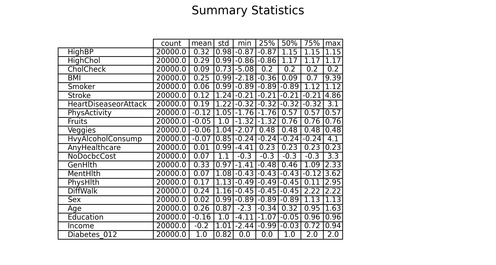

# Understanding What Factors Lead To Diabetes Using Machine Learning

## Tanjodh Hayer (301432974), Mohammad Haris Ahmad (301427462), Inderpreet Rangi (301433641)
## Simon Fraser University, CMPT 459 - Fall 2024

### Problem Statement
Diabetes is a common health issue that many people face. We wanted to figure out what were some of the leading factors that cause it such that at-risk individuals can be identified early, potentially reducing the prevalence or severity of diabetes. 

### Selected Dataset: 
Diabetes Health Indicators Dataset: [https://www.kaggle.com/datasets/alexteboul/diabetes-health-indicators-dataset]
This dataset came from Kaggle and it represents the connections between the human lifestyle and diabetes within the United States of America. Each row within this dataset is a US citizen who had participated in this survey conducted by the CDC. This dataset has 253681 entries and consist of the following features
Numerical:
- BMI (Body Mass Index)
- GenHlth (General health status, rated on a scale)
- MentHlth (Mental health status, rated on a scale)
- PhysHlth (Physical health status, rated on a scale)
- Age (Age category)
- Education (Education level)
- Income (Income level)
Categorical:
- Diabetes_012 (Diabetes classification: No diabetes,Prediabetes, Diabetes)
- HighBP (High blood pressure status: Yes or No)
- HighChol (High cholesterol status: Yes or No)
- CholCheck (Cholesterol check status: Yes or No)
- Smoker (Smoking status: Yes or No) 
- Stroke (Stroke status: Yes or No)
- HeartDiseaseorAttack (Heart disease or attack status: Yes or No)
- PhysActivity (Physical activity status: Yes or No)
- Fruits (Fruit consumption: Yes or No)
- Veggies (Vegetable consumption: Yes or No)
- HvyAlcoholConsump (Heavy alcohol consumption status: Yes or No)
- AnyHealthcare (Access to healthcare: Yes or No)
- NoDocbcCost (Cost barriers to healthcare: Yes or No)
- DiffWalk (Difficulty walking status: Yes or No)
- Sex (Gender: Female or Male)

 
To run this program enter the following command: 
python main.py --data "dataset.csv"

### Data Table (5 Rows)

| Diabetes_012 | HighBP | HighChol | CholCheck | BMI | Smoker | Stroke | HeartDiseaseorAttack | PhysActivity | Fruits | Veggies | HvyAlcoholConsump | AnyHealthcare | NoDocbcCost | GenHlth | PhysHlth | DiffWalk | Sex | Age | Education | Income |
|--------------|--------|----------|-----------|-----|--------|--------|----------------------|--------------|--------|---------|-------------------|---------------|-------------|---------|----------|----------|-----|-----|-----------|--------|
| 0            | 1      | 1        | 1         | 40  | 1      | 0      | 0                    | 0            | 0      | 1       | 0                 | 1             | 0           | 5       | 18       | 1       | 1   | 7   | 6         | 4      |
| 0            | 0      | 0        | 0         | 25  | 1      | 0      | 0                    | 0            | 1      | 0       | 0                 | 0             | 1           | 0       | 0        | 0        | 0   | 4   | 5         | 6      |
| 2            | 1      | 1        | 1         | 30  | 1      | 0      | 1                    | 1            | 0      | 0       | 1                 | 1            | 1           | 0       | 0        | 1        | 0   | 6   | 6         | 5      |
| 1            | 1      | 1        | 1         | 32  | 1      | 1      | 0                    | 1            | 0      | 0       | 1                 | 0             | 1           | 0       | 30       | 1        | 0   | 12   | 4         | 5      |
| 0            | 1      | 0        | 1         | 30  | 0      | 0      | 0                    | 1            | 1      | 1       | 0                 | 1             | 0           | 0       | 0        | 1        | 0   | 9   | 3         | 4      |

## Methodology
### Data Preprocessing
Data preprocessing is a crucial step in preparing raw data for the machine learning tasks that follow. Here's a detailed overview of the steps we implemented:

We began by converting all categorical columns into numeric values using label encoding. This transformation ensures compatibility with machine learning models, which generally require numerical inputs. Encoding these features enabled their effective use during the training of the three chosen models.

The target variable, Diabetes_012, was rounded and converted to an integer type, with the classes represented as follows:

    0: No Diabetes
    1: Diagnosed Diabetes
    2: Prediabetic.

This conversion was performed to maintain consistency and prevent errors during model training and classification.

To handle missing data, we imputed missing values in the features using the mean of each column. This approach preserves dataset completeness while providing reasonable estimates for missing entries.

Feature standardization was also applied, ensuring all features had a mean of 0 and a standard deviation of 1. This step is particularly important for algorithms like K-Means and Support Vector Machines (SVM), which are sensitive to feature scaling. Standardization improved model convergence and overall performance.

Our initial dataset contained over 200,000 samples, but there was a significant class imbalance. To address this, we applied SMOTE (Synthetic Minority Oversampling Technique) to balance the class distribution by generating synthetic samples for the minority classes. Without balancing, the models could become biased toward the majority class. However, applying SMOTE increased the dataset size to over 600,000 samples, which was computationally prohibitive. To resolve this, we reduced the dataset to 20,000 samples using stratified subsampling. This method preserved the class proportions, ensuring an equal class distribution while making the dataset manageable for machine learning tasks. By subsampling, we retained the dataset's integrity while enabling efficient model training, classification, and clustering.

To verify the effectiveness of our preprocessing, we visualized the class distributions before and after SMOTE and subsampling. These plots provide clear evidence of the process and outcomes.

Finally, to save time during subsequent runs, the processed dataset was saved as dataset_processed.csv. A utility function checks for the existence of this file:

    If the file exists, the code skips preprocessing and directly loads the cleaned, balanced, and scaled dataset.
    If the file does not exist, the preprocessing pipeline runs on the original dataset to regenerate and save the processed version.

### Class Distribution Before SMOTE

### Class Distribution After SMOTE and Stratified Sampling

### Exploratory Data Analysis (EDA)

Exploratory Data Analysis (EDA) is an essential step in understanding the underlying patterns and relationships within a dataset. It helps to detect anomalies, check assumptions, and provide insights into the structure of the data. In this analysis, we performed EDA by calculating summary statistics, visualizing key features, and analyzing the correlations between them.

Summary Statistics: We began by generating a summary of the dataset using the describe() function. This provides basic statistical metrics, such as the mean, standard deviation, minimum, maximum, and percentiles for all numerical features, helping to understand the distribution and range of values in the dataset.

Visualizing Distributions: Histograms were used to visualize the distributions of key features. This step helps identify the shape of the distributions (e.g., normal, skewed) and potential transformations needed to improve model performance or meet statistical assumptions.

Correlation Analysis: We calculated the correlation matrix to examine relationships between numerical features. A heatmap was created to visualize these correlations, enabling us to understand how features are related and identify any potential multicollinearity or redundant features.

### Outlier Detection
Outlier detection is being done using three algorithms to identify exreme or anomalous values that could distort the results of the classification and modeling. Outliers can skew results and affect model performance as well as clustering results since clustering is sensitive to extreme values. We did outlier detection using three algrothims respectively, Local Outlier Factor (LOF), isolation forest (IF) and Elliptic Envelope (EE); for visualization of this the outliers are in red and inliers are in blue. Two parameters we used for these methods were contamination and random_state. Random_state was set to 42 for reproducibility while contatminationw as set to 0..02 ie. 2% after trying various rates because there is a decent amount of skewness after using ssmote and the irregularness of data for medical  features as its varies greatly depending on people. However, the reason ccontatmination is not set higher is because normal data would end up being flagged as outliers
•	LOF: Detects the local denity of data points and identifies points that are significantly lower compared to its neighbours where in it flags those outliers.
_Plot.png)
•	IF: the dataset is randomly portioned thereby isolating points, the more isolated a point is the more likely its an outlier this method is also useful for high dimensional data.
_Plot.png)
•	EE: identifies points that lie outside the expected distribution as outliers. It works well when the data follows a normal distribution and detects outliers based on their deviation from the fitted "ellipse."
_Plot.png)
All three of these methods provided somewhat similar results which showed the outliers, after visualling all of the outliers we decided whether to remove them or not by running the program and checking if the classification accuracy increases or not as well as how the clustering does. After comparing results we noticed that removing outliers helped train our model with higher accuracy.
as seen with the random forest classifcation done with outliers removed, and kept.

Performing 5-fold cross-validation for Default Random Forest with outliers removed
Mean F1-score from 5-fold CV: 0.6557
Accuracy: 0.6793
Precision: 0.6728
Recall: 0.6792
F1-score: 0.6751
AUC-ROC: 0.8468

Performing 5-fold cross-validation for Default Random Forest with outliers kept
Mean F1-score from 5-fold CV: 0.6642
Accuracy: 0.6673
Precision: 0.6615
Recall: 0.6685
F1-score: 0.6642
AUC-ROC: 0.8420

### Feature Selection

### Clustering

### Classification

### Hyperparemeter Tuning

### Conclusion